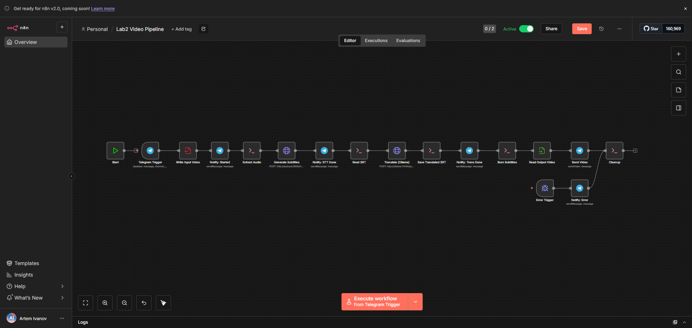
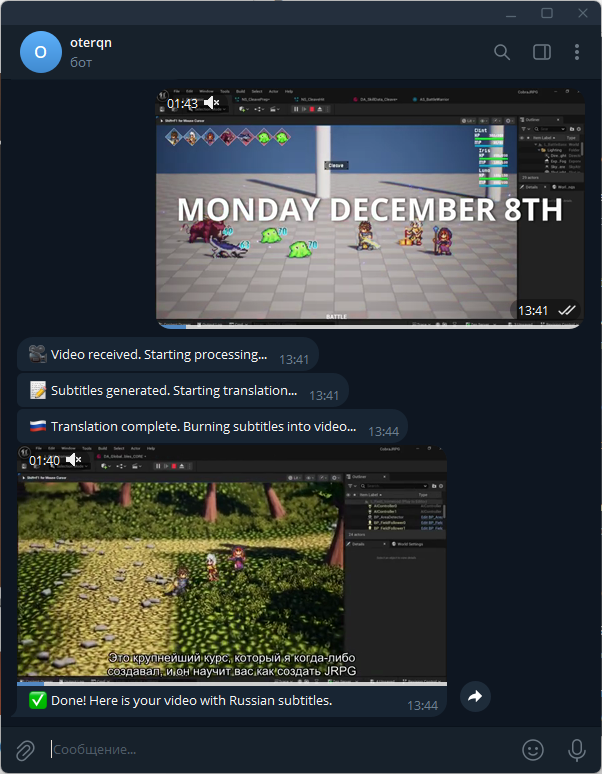
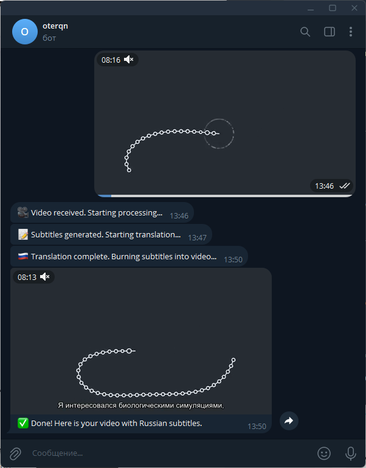

# Отчет по лабораторной работе №2

## Выполнил: Иванов Артем 6233

## Суть
Конвейер обработки видео с использованием Telegram Bot, n8n, ffmpeg, auto-subtitle и LLM для автоматического создания субтитров и перевода (EN -> RU).

## Архитектура

1.  **n8n**: Оркестратор рабочих процессов. Отвечает за логику бота, управление файлами и вызовы внешних сервисов.
    *   Образ: `docker.n8n.io/n8nio/n8n:latest` (Alpine Linux).
    *   Установлен `ffmpeg` для обработки медиа.
2.  **autosub**: Специализированный микросервис для Speech-to-Text (STT).
    *   Образ: `python:3.10-slim` (Debian).
    *   Использует `auto-subtitle` (на базе OpenAI Whisper) и `FastAPI` для HTTP-интерфейса.
    *   Решает проблему совместимости PyTorch c Alpine Linux.
3.  **Ollama**: Локальный сервер LLM для перевода субтитров.
    *   Модель: `llama3`.
4.  **ngrok**: Туннелирование трафика для обеспечения HTTPS Webhook от Telegram к локальному n8n.

## Детали реализации

### Конфигурация Docker
- **n8n/Dockerfile**: Стандартный образ с добавлением `ffmpeg`.
- **autosub/Dockerfile**: Python-окружение с установленными `torch` (CPU), `ffmpeg-python`, `fastapi` и `auto-subtitle`.
- **docker-compose.yml**: Связывает сервисы, настраивает общие тома (`./n8n/files:/files`) для передачи видеофайлов между контейнерами.

### Логика рабочего процесса (n8n Workflow)
1.  **Telegram Trigger**: Получает видеофайл от пользователя.
2.  **Write Binary File**: Сохраняет видео в `/files/input.mp4`.
3.  **Extract Audio (ffmpeg)**: Извлекает аудиодорожку в `/files/audio.wav`.
4.  **Generate Subtitles (HTTP Request)**: Отправляет POST-запрос в сервис `autosub` (`http://autosub:5000/transcribe`), инициируя генерацию субтитров.
5.  **Translate (Ollama)**:
    - Читает созданный SRT файл.
    - Отправляет содержимое в Ollama с промптом для перевода на русский язык с сохранением таймкодов.
    - Ответ сохраняется в `/files/out_ru.srt`.
6.  **Burn Subtitles (ffmpeg)**: Вшивает переведенные субтитры в видео (`hardsub`).
7.  **Send Video**: Отправляет готовое видео пользователю в Telegram.
8.  **Cleanup**: Удаляет временные файлы при успешном завершении или ошибке.

## Проблемы и решения
1.  **PyTorch на Alpine Linux**: Библиотека `auto-subtitle` требует PyTorch, который неуспешно установливается на базовом образе n8n из-за несовместимости с `musl libc`.
    *   *Решение*: Вынос логики STT в отдельный микросервис (`autosub`) на базе Debian, где PyTorch работает стабильно.
2.  **Webhook и динамический URL**: При использовании бесплатного ngrok URL меняется при каждом перезапуске.
    *   *Решение*: Ручная регистрация через API Telegram при смене адреса.

## Скриншоты
### Workflow Pipeline n8n

### Telegram Bot

## Вывод
Разработанный конвейер успешно автоматизирует полный цикл локализации видео: от получения файла до выдачи результата с русскими субтитрами, используя локальные нейросети и микросервисный подход.

## Шаги для запуска
1. Создание `.env` файла с переменными (см. [`.env.example`](/.env.example)).
2. `docker-compose up -d`
3. `docker exec -it ollama_service ollama pull llama3`
4. Настройка Webhook URL
    - Узнайте NGROK URL в http://localhost:4040/status
    - `docker-compose stop n8n`
    - Внесите актуальный URL в `.env`
    - Выполните (можео в браузере) `https://api.telegram.org/bot<токен_вашего_бота>/setWebhook?url=<ваш_ngrok_url>/webhook/telegram-trigger`
    - `docker-compose up -d n8n`
5. Настройка пайплайна n8n
    - Перейдите http://localhost:5678
    - Создайте пайплайн с заданной [конфигурацией](/n8n/workflow_pipeline.json)
    - Внести все необходимые API ключи
    - Активируйте
